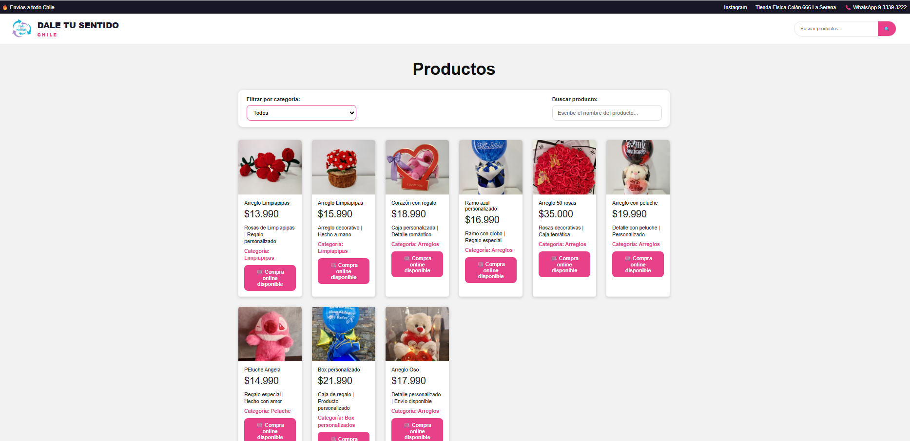

Nombre del proyecto: Dale tu sentido
Tienda de regalos ubicada en La Serena.
componentes
HeaderTienda -> archivo HeaderTienda ->Encabezado, logo
SeachBar -> archivo SearchBar.jsx Función -> Busqueda de productos
Tarjeta -> archivo Tarjeta.jsx -> Tarjeta de productos
Boton -> archivo ->Boton.jsx -> Botón reutilizable.
Footer -> Archivo Footer.jsx -> Pie de página

# Módulo React - Tienda Dale tu Sentido

Proyecto desarrollado con **React + Vite**, orientado a la creación de una tienda online simple para mostrar productos, filtrar por categoría y buscar productos mediante un input controlado.

## Tecnologías utilizadas

* React
* Vite
* JavaScript
* HTML
* CSS
* JSON

## Instalación del proyecto

Para ejecutar este proyecto en un computador local, primero se debe clonar o descargar el repositorio.

Luego, abrir la carpeta del proyecto en Visual Studio Code y ejecutar en la terminal:

```bash
npm install
```

Este comando instala todas las dependencias necesarias del proyecto.

## Ejecutar el proyecto

Para iniciar el servidor de desarrollo, ejecutar:

```bash
npm run dev
```

Luego abrir en el navegador la URL que aparece en la terminal, por ejemplo:

```bash
http://localhost:5173/
```

Si Vite muestra otro puerto, por ejemplo `5174`, se debe abrir ese enlace.

## Estructura principal del proyecto

```text
src/
├── assets/
│   ├── logo.png
│   └── img/
├── components/
│   ├── Boton.jsx
│   ├── Footer.jsx
│   ├── HeaderTienda.jsx
│   ├── SearchBar.jsx
│   └── Tarjeta.jsx
├── data/
│   └── productos.json
├── App.css
├── App.jsx
├── index.css
└── main.jsx
```

## Componentes del proyecto

### HeaderTienda

Muestra el encabezado de la tienda, incluyendo el logo, nombre de la tienda e información principal.

### SearchBar

Componente con input controlado que permite buscar productos por nombre, detalle o categoría.

### Tarjeta

Componente encargado de mostrar la información de cada producto, incluyendo imagen, nombre, precio, detalle, categoría y botón de acción.

### Boton

Componente reutilizable para botones. Permite utilizar variantes como `primary` y `secondary`.

### Footer

Muestra información básica de la tienda, contacto y categorías principales.

## Datos de productos

La información de los productos se encuentra en:

```text
src/data/productos.json
```

Cada producto tiene la siguiente estructura:

```json
{
  "id": 1,
  "titulo": "Rosas rojas tejidas",
  "precio": "$13.990",
  "detalle": "Rosas de jabón | Regalo personalizado",
  "categoria": "Rosas de jabón",
  "accion": "Compra online disponible",
  "imagen": "producto1.jpg"
}
```

Las imágenes deben estar guardadas en:

```text
src/assets/img/
```

El nombre de la imagen en el archivo JSON debe coincidir exactamente con el nombre del archivo de imagen.

## Funcionalidades implementadas

* Visualización de productos desde un archivo JSON.
* Renderizado de lista usando `map`.
* Filtro de productos por categoría.
* Barra de búsqueda con input controlado.
* Uso de componentes reutilizables.
* Botón reutilizable con variantes.
* Header y Footer personalizados.
* Diseño responsive mediante CSS.

## Comandos útiles

Instalar dependencias:

```bash
npm install
```

Ejecutar proyecto:

```bash
npm run dev
```

Detener proyecto:

```bash
Ctrl + C
```

## Repositorio

Proyecto desarrollado para el módulo React.

Repositorio:

```text
https://github.com/eaninir/modulo_react
```


